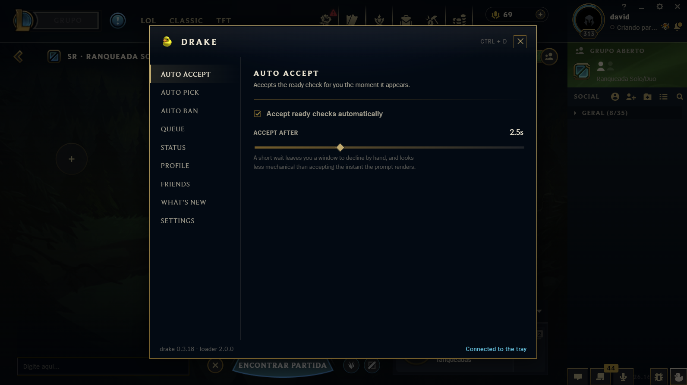
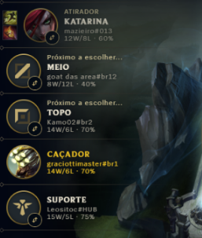
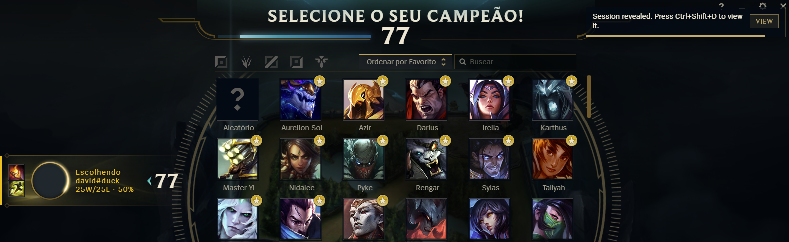
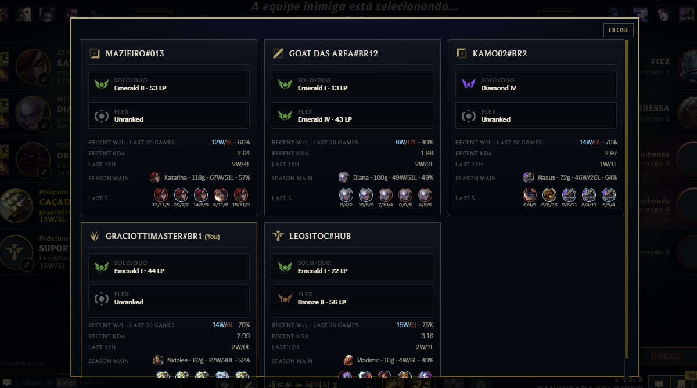
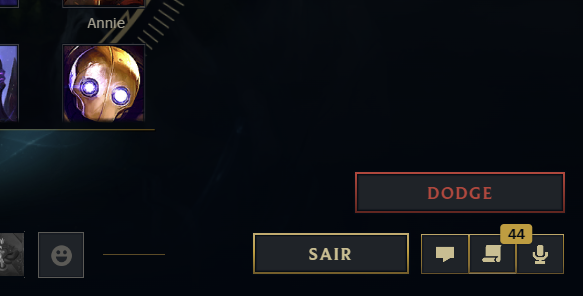
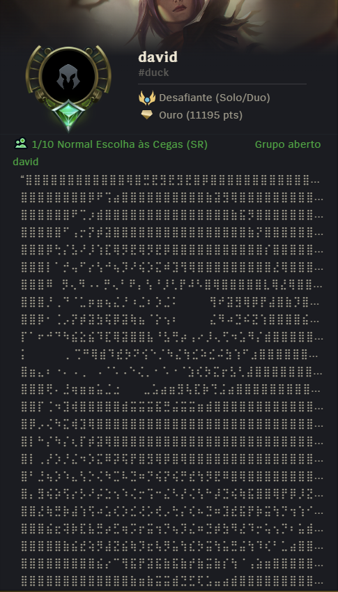

# Drake

League of Legends client overlay for auto accept, champ select, and profile tools. A tray app on Windows keeps the plugin injected.

Drake is unofficial and is not endorsed by Riot Games. Using it may violate the League of Legends Terms of Use. You run it at your own risk.

<p align="center">
  <strong>Overlay home</strong><br>
  Open with Ctrl + D or the duck button in the bottom-right corner.
</p>
<p align="center">
  
</p>

## What it does

Open the overlay with **Ctrl + D**, or click the duck button in the **bottom-right corner** of the client.

| | Feature | Description |
| --- | --- | --- |
| ⚡ | Auto Accept | Ready-check accept with optional delay |
| 🗡️ | Auto Pick | First + backup champ per role, with Insta Lock |
| 🚫 | Auto Ban | Ban a chosen champion automatically |
| 🔍 | Lobby Reveal | Open team scouting on Porofessor / op.gg / etc. |
| 👁️ | In-client Team Reveal | Ally rows + stats cards in champ select |
| 🚪 | Dodge | Champ-select dodge button (with usual penalty) |
| 💬 | Status | Custom status message and availability |
| 🏅 | Profile | Rank crest, banner skins, Riot ID tools |
| 👥 | Friends | Friends list tools |
| ⚙️ | Settings | Start with Windows, auto reload, auto updates |

The tray is the source of truth for settings. The overlay reads and writes them through the tray, so they survive a client restart. With automatic updates on, Drake checks GitHub for a newer release, downloads the installer, and runs it. Windows will ask for permission because the app lives in Program Files.

## Screenshots

<p align="center">
  <strong>In-client team reveal</strong><br>
  Ally rows show Riot ID and recent win rate while you are in champ select.
</p>
<p align="center">
  
</p>

<p align="center">
  <strong>Session revealed toast</strong><br>
  When the lobby is ready, Drake prompts you to open the stats cards.
</p>
<p align="center">
  
</p>

<p align="center">
  <strong>Team stats cards</strong><br>
  Press Ctrl + Shift + D to see ranks, recent form, and recent champs for your team.
</p>
<p align="center">
  
</p>

<p align="center">
  <strong>Dodge</strong><br>
  Leave champ select from the in-client Dodge button. The usual dodge penalty still applies.
</p>
<p align="center">
  
</p>

<p align="center">
  <strong>Status and rank crest</strong><br>
  Set a custom status (including ASCII art) and change the profile rank crest from the overlay.
</p>
<p align="center">
  
</p>

## Installation / How to use

1. Download the latest installer from the [GitHub Releases](https://github.com/sluucke/drake-lol/releases) page.
2. Run the installer. Windows will ask for permission (Drake installs under Program Files).
3. Drake starts in the system tray. Keep it running while you play.
4. Open League of Legends. If the client was already open, use **Reload client to apply** in the tray menu.
5. Open the overlay with **Ctrl + D**, or click the duck button in the bottom-right corner of the client.
6. Turn on the features you want. Settings are saved by the tray and survive a client restart.

In champ select, **Ctrl + Shift + D** opens the in-client team stats cards when that feature is enabled. Uninstall from the tray menu when you no longer want Drake.

## Requirements

* Windows 10 or later
* League of Legends
* For development: Rust (stable), Node.js 20 or later, and Visual Studio C++ build tools

## Development

```bash
cd plugin
npm install
npm test
npm run build
```

```bash
cargo test --manifest-path src-tauri/Cargo.toml
cargo build --release --manifest-path src-tauri/Cargo.toml
```

The tray binary is `src-tauri/target/release/drake.exe`. If League is already open after a plugin change, use **Reload client to apply** in the tray (or restart client UX) so the new bundle loads.

`plugin/dist/index.js` is committed on purpose. The Rust build embeds that file, so a clone can build without Node.

## Layout

* `plugin/` in-client overlay (JavaScript) and its tests
* `src-tauri/` tray app, installer, and injection
* `vendor/pengu-loader/` pinned loader core shipped with the installer

## Contributing

See [CONTRIBUTING.md](CONTRIBUTING.md). Please read [CODE_OF_CONDUCT.md](CODE_OF_CONDUCT.md) as well.

## Security

See [SECURITY.md](SECURITY.md).

## License

Drake is MIT. See [LICENSE](LICENSE).

The installer vendors a copy of Pengu Loader (`vendor/pengu-loader/`), which is MIT as well. See `vendor/pengu-loader/LICENSE`.
